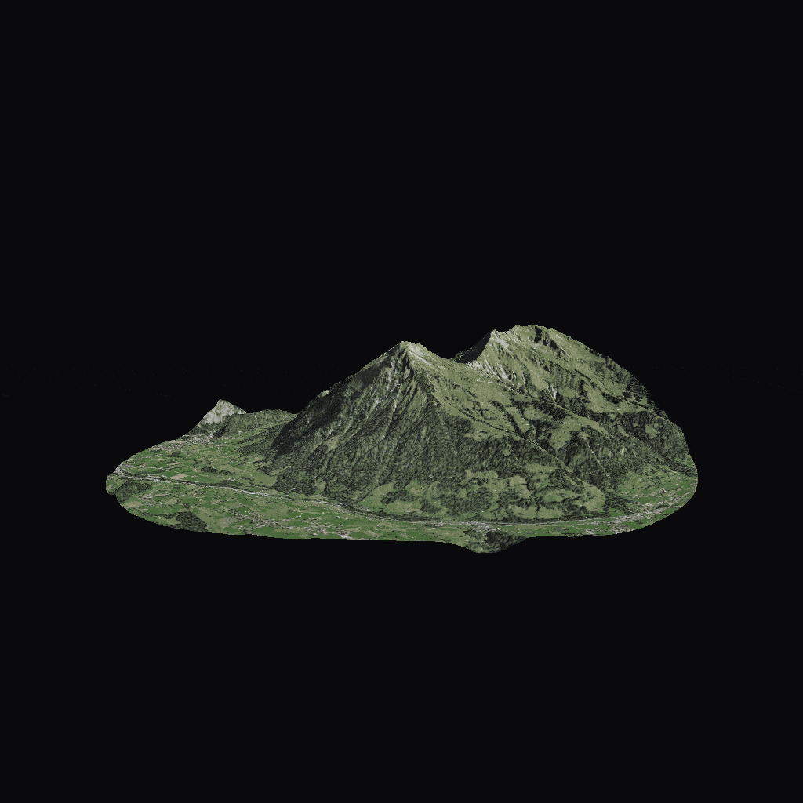

# SwissMountains

A python project that accesses [swissALTI3D](https://opendata.swiss/de/dataset/swissalti3d), [SWISSIMAGE](https://opendata.swiss/de/dataset/swissimage-10-cm-digitale-orthophotomosaik-der-schweiz) and [swissNAMES3D](https://opendata.swiss/en/dataset/swissnames3d-geografische-namen-der-landesvermessung) from swisstopo to export 3D-terrain images.



## Sample Anki-Package
[](https://github.com/ttschnz/swiss_mountains/raw/main/docs/assets/Mountains.apkg)

## Timeline
- [ ] Optimize for speed
  - [x] speed up python
  - [ ] Oxidize (rewrite in rust)
- [x] Export to anki-flashcards
- [ ] Dockerize
- [ ] web-api
- [ ] Documentation, inline comments

## Building Instructions
### Requirements
on Nixos, make sure to set `hardware.graphics.enable = true;` in your `/etc/nixos/configuration.nix`. Then you can just type
```bash
nix-shell .
```
to install dependencies. For other systems, make sure you have **python 3.12.x**, these python packages:
```
virtualenv
setuptools
matplotlib
numpy
scipy
requests
pillow
imageio
genanki
maturin
```
and **rust** installed. Other dependencies might be required (not tested).
### Building
First we need to build the rust library. To do this, run
```
cd rust && maturin develop
```
Once the build is complete, you can run the python script by running
```
cd ..
python main.py
```
